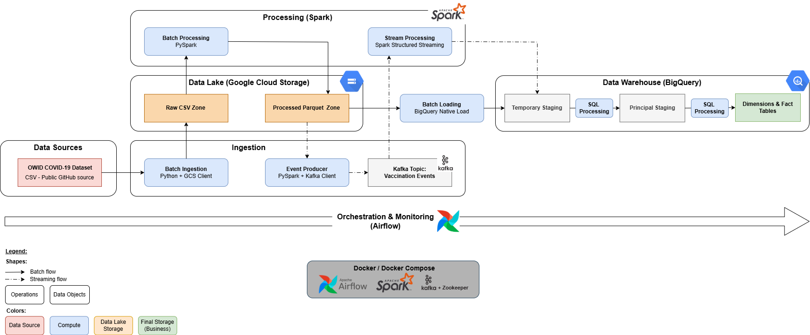

# Projet Data Engineering – Pipeline OWID COVID-19


## Evolution du projet
- **V1 (local)** : pipeline batch + streaming avec stockage local via PostgreSQL
- **V2 (cloud)** : pipeline batch + streaming avec stockage cloud 
  - Data Lake sur **GCS (raw / processed)**  
  - Data Warehouse sur **BigQuery**    

⚠️ **Note :** Une branche `archive/v1-local` contient la version initiale du projet (PostgreSQL local).  

## Présentation du projet
Ce projet implémente un **pipeline de data engineering de bout en bout** dans une architecture de type **Data Platform cloud**.

Objectifs :
- reproduire des **conditions proches de la production**,
- mettre en œuvre les **bonnes pratiques data engineering**,
- concevoir une architecture **Data Lake + Data Warehouse**,  
- manipuler des traitements **batch et streaming**.

Le pipeline exploite les données publiques COVID-19 de **Our World in Data (OWID)** et permet de suivre l’évolution de la vaccination à l’échelle mondiale.

## Objectif métier
> **Suivre l’évolution de la couverture vaccinale COVID-19 dans le monde et permettre la détection d’anomalies ou de retards dans la vaccination.**

Cette problématique guide :
- la modélisation analytique (dimensions / faits),
- le choix d’une architecture **batch + streaming**.

## Source de données
- **Source** : Our World in Data – COVID-19
- **Format** : CSV
- **Accès** : dépôt GitHub public
- **URL** : https://raw.githubusercontent.com/owid/covid-19-data/master/public/data/owid-covid-data.csv

Les données sont mises à jour régulièrement et contiennent des indicateurs journaliers par pays.

## Architecture globale
<p align="center">
  
  <br>
  <em>Figure 1: Architecture globale de la Data Platform (Medallion Pattern)</em>
</p>

Diagramme : ([`pipeline_architecture_cloud.png`](docs/diagrams/pipeline_architecture_cloud.png))

Le projet repose sur une architecture **Data Platform** en couches :
- **Sources de données**
- **Ingestion (batch & streaming)**
- **Processing (Spark)**
- **Data Lake (GCS)** : stockage raw et processed
- **Data Warehouse (BigQuery)** : modélisation analytique
- **Orchestration (Airflow)**
- **Exécution (Docker)**

### Choix d'architecture
- **Pattern Medallion** : Structuration des données selon 3 zones (Bronze (Raw), Silver (Staging) et Gold (Business))
- **Découplage Storage/Compute** : Utilisation de GCS pour le stockage persistant et de Spark pour le calcul
- **Format Parquet** : Choix du Parquet pour la couche processed pour un gain de coût sur GCS et une rapidité de lecture pour Spark

## Flux de données
Le pipeline implémente **deux flux complémentaires** :
### Flux Batch
1. Ingestion du dataset OWID → **GCS raw**  
2. Transformation via **Spark**  
3. Écriture en Parquet → **GCS processed**  
4. Chargement natif vers **BigQuery (staging temporaire)**  
5. Déduplication + upsert → **staging principale**  
6. Alimentation des tables **dimensionnelles et factuelles**

### Flux Streaming (simulation)
1. Lecture des données depuis **GCS processed**  
2. Simulation d’événements via un **Kafka Producer**  
3. Publication des événements dans un **topic Kafka** 
4. Consommation via **Spark Structured Streaming**  
5. Écriture dans **BigQuery (staging temporaire)**  
6. Déduplication + upsert → **staging principale**  
6. Alimentation des tables **dimensionnelles et factuelles**

Diagramme : ([`data_flow.png`](docs/diagrams/data_flow.png))

## Architecture logique du pipeline
### Couche d’ingestion
#### Ingestion Batch
- **Outil :** Python
- **Opérations clés :**
   - Téléchargement du CSV OWID,
   - Stockage des données brutes,
   - Ajout de métadonnées d’ingestion.

#### Ingestion Streaming
- **Outil :** Apache Kafka
- **Rôle :** Kafka Producer
- **Opérations clés :**
  - lecture des données traitées,
  - émission des événements de vaccination,
  - simulation d'un flux quasi temps réel.

### Couche de traitement
#### Traitement Batch
- **Outil :** Apache Spark (PySpark)
- **Opérations clés :**
  - nettoyage des données,
  - profiling,
  - transformations métier.

#### Traitement Streaming
- **Outil :** Spark Structured Streaming
- **Opérations clés :**
   - Consommation des messages Kafka,
   - Validation de schéma,
   - Traitement en micro-batch.

### Couche de stockage
#### Data Lake – GCS
- `raw/` : données brutes CSV  
- `processed/` : données transformées en Parquet  

#### Data Warehouse – BigQuery
- Tables de **staging** communes batch & streaming  
- Tables **dimensionnelles** (`dim_date`, `dim_location`)  
- Table de **faits** (`fact_vaccination`) 

Diagramme : ([`dwh_schema.png`](docs/diagrams/dwh_schema.png))

### Orchestration & monitoring
- **Outil :** Apache Airflow
- Deux DAGs principaux :
  - **DAG Batch** : ingestion → traitement → stockage
  - **DAG Streaming** : producer Kafka → consumer Spark → stockage

Airflow gère :
- les dépendances,
- la planification,
- les retries,
- les logs d’exécution.

Diagramme : ([`airflow_dags.png`](docs/diagrams/airflow_dags.png))

## Déploiement & environnement
Le pipeline est exécuté localement via **Docker & Docker Compose** (Airflow, Spark, Kafka), tout en s’appuyant sur des services cloud :
- **Google Cloud Storage (GCS)** : Data Lake  
- **BigQuery** : Data Warehouse  

Ce choix permet de reproduire une architecture réaliste tout en maîtrisant les coûts.

L'exécution via Docker assure : 
- la reproductibilité,
- l’isolation des services,
- une exécution locale simplifiée.

Diagramme : ([`docker_architecture.png`](docs/diagrams/docker_architecture.png))

## Exécution rapide
Pour tester le pipeline OWID COVID-19 en local avec Docker Compose :

```bash
# Lancer tous les services (Airflow, Spark, Kafka, Zookeeper)
docker-compose up --build -d

# Lancer le DAG batch via Airflow UI ou CLI
# Exemple CLI :
docker exec -it <airflow_container> airflow dags trigger owid_batch_pipeline
```

## Structure du projet
```bash
├── airflow/           # DAGs et logs pour l'orchestration
│   ├── dags/
│   │   ├── owid_batch_pipeline.py
│   │   └── owid_streaming_pipeline.py
│   └── logs/
├── data/              # Données pour l'exécution
│   ├── checkpoints/
│   └── profiling/
├── src/               # Code source
│   ├── config/
│   ├── ingestion/
│   ├── profiling/
│   ├── transformation/
│   ├── storage/
│   │   ├── bigquery/
│   │   └── gcs/
│   ├── streaming/
│   └── utils/
├── docker/            # Dockerfiles pour conteneurs
│   ├── Dockerfile.airflow
│   ├── Dockerfile.spark
│   └── jars/
├── docker-compose.yml # Orchestration multi-conteneurs
├── docs/              # Documentation
├── .gitignore
└── README.md
```

## Améliorations futures
- Gestion de l’évolution des schémas
- Historisation du staging
- Alerting sur anomalies

## Conclusion
Ce projet vise à démontrer :
- la conception d’une **Data Platform cloud (GCS + BigQuery)**,
- la mise en œuvre de pipelines **batch et streaming**,
- l’intégration d’outils clés : Spark, Kafka, Airflow,
- une architecture **scalable, reproductible et proche des standards industriels**.

## Auteur
Maï Louisgrand - Data Engineer Junior 
([`LinkedIn`](https://www.linkedin.com/in/mai-louisgrand/))

## License
Code open source – usage personnel / à des fins de démonstration uniquement
